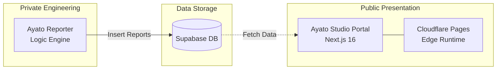

# Ayato Studio Portal (Intelligence Synergy)

[](https://nextjs.org/)
[](https://reactjs.org/)
[](https://pages.cloudflare.com/)
[](https://supabase.com/)
[](https://www.gnu.org/licenses/agpl-3.0)
[](COMMERCIAL.md)

**Ayato Studio Portal** is a next-generation intelligence media platform that harmonizes automated AI analysis with deep human insights. It serves as the front-end interface for the **Ayato Intelligence Hub**, displaying real-time market research and strategic reports.

[**Live Demo: ayato-studio.ai**](https://ayato-studio.ai)

---

## 🌟 Key Features

- **24/7 AI-Driven Intelligence**: Automatically aggregates and synthesizes global tech/market news via the private *Ayato Reporter* engine.
- **Hybrid Content Architecture**:
    - **Flow**: Real-time reports generated by AI agents (stored in Supabase).
    - **Stock**: In-depth strategy or technical articles written by humans (Markdown-based).
- **Edge-Powered ISR**: Built on Next.js 16 and deployed on Cloudflare Pages (Edge Workers) using **Incremental Static Regeneration (ISR)** for high-speed delivery and fresh content.
- **Premium UX**: Modern, minimalist dark-mode interface with smooth animations and responsive design.

---

## 🏗️ System Architecture



---

## 🛠️ Technology Stack

- **Framework**: [Next.js 16](https://nextjs.org/) (App Router)
- **Runtime**: [React 19](https://react.dev/), [Cloudflare Workers](https://workers.cloudflare.com/)
- **Database**: [Supabase](https://supabase.com/) (PostgreSQL + RLS)
- **Styling**: [Tailwind CSS 4](https://tailwindcss.com/)
- **Animations**: [Framer Motion](https://www.framer.com/motion/)
- **Deployment**: [Cloudflare Pages](https://pages.cloudflare.com/) via `@cloudflare/next-on-pages`

---

## 🚀 Getting Started

### Local Development

1. Clone the repository:
   ```bash
   git clone https://github.com/Ayato-AI-for-Auto/ayato-studio-portal.git
   cd ayato-studio-portal
   ```

2. Install dependencies:
   ```bash
   npm install
   ```

3. Set up environment variables:
   Create a `.env.local` file:
   ```env
   NEXT_PUBLIC_SUPABASE_URL=your_supabase_url
   NEXT_PUBLIC_SUPABASE_ANON_KEY=your_anon_key
   ```

4. Run the development server:
   ```bash
   npm run dev
   ```

### Deployment

Deploy to Cloudflare Pages using the integrated build command:
```bash
npm run pages:build
```

---

## 🏛️ Content Layers

| Layer | Content Type | Source | Purpose | Revalidation |
| :--- | :--- | :--- | :--- | :--- |
| **Tier 1: Reports** | Market Intelligence | Supabase (AI) | Fast signal detection | 60s (ISR) |
| **Tier 2: Blog** | Strategic Insights | Local Markdown | Deep theory | Static |
| **Tier 3: Services**| Portfolio | Local Markdown | Brand value | Static |

---

## 📄 License & Dual-Licensing Strategy

This project is dual-licensed under:
1.  **[GNU Affero General Public License v3 (AGPL-3.0)](LICENSE)**: For open-source use. If you use this software to provide a network service, you must release your source code.
2.  **Commercial License**: For organizations that wish to use the software without the AGPL-3.0 restrictions. Please see **[COMMERCIAL.md](COMMERCIAL.md)** for details.

### Contributing
By contributing to this repository, you agree to our **[Contributor License Agreement (CLA)](CLA.md)**. This allows us to maintain the dual-licensing model and protect the project's sustainability.

---

Developed and maintained by **Ayato Studio** as a demonstration of synergistic AI workflow integration.
The backend engine (*Ayato Reporter*) is a proprietary system and not included in this repository.

---

## 🛡️ Security Audit

Before each release, a Row Level Security (RLS) audit is performed to ensure that the anonymous Supabase key is restricted to read-only access.

```bash
npm run audit:rls
```
