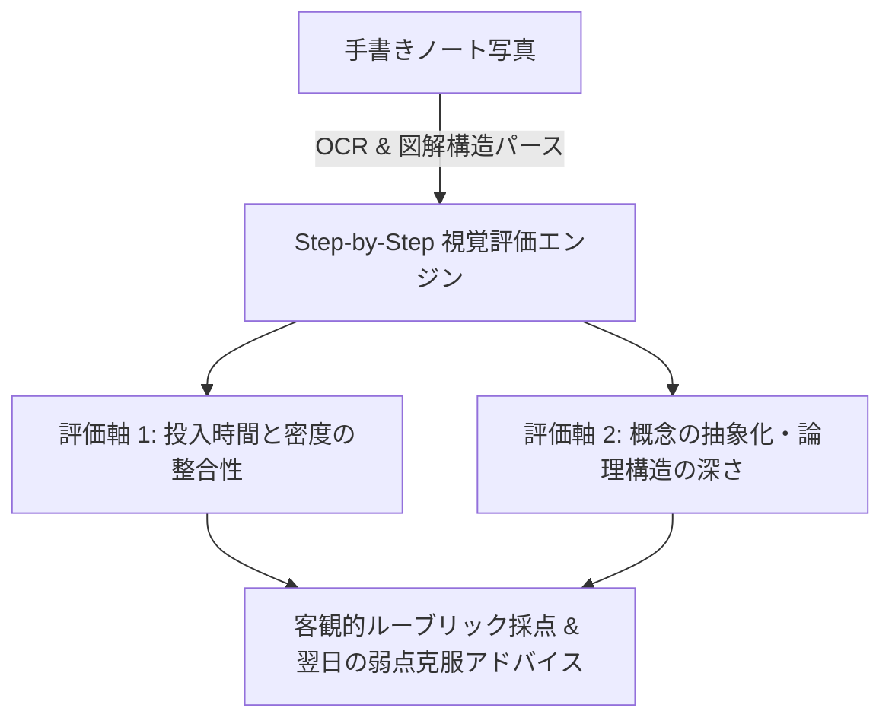

# なぜ学習管理にローカルAIが必要なのか？手書きノートをOCR評価する1万時間トラッカーの設計思想

司法試験、公認会計士、医師国家試験、あるいは難関大学受験や高度なエンジニアリングスキルの習得において、多くの学習者が共通して陥る「最大の罠」があります。

> **「アプリに勉強時間を入力して満足し、『中身の理解度（質）』が伴っていないことに本番直前まで気づけない。」**

学習時間（量）は測定しやすいため、多くの学習管理アプリはストップウォッチ機能と綺麗な円グラフを提供することに終始しています。しかし、本当に重要なのは**「今日費やした3時間で、どれだけ概念の核心を理解できたか」**です。

この課題を解決するために我々が設計・開発したのが、**[TenKOrbit（1万時間オービット）](/services/tenk-orbit)** です。

---

## 1. 「時間」だけでなく「手書きノートの質」をAIが評価する

人間は、自分の理解度を自己評価する際に強いバイアス（ダニング＝クルーガー効果）を受けます。

TenKOrbit では、1日の学習終了時に作成した手書きノートやマインドマップの写真をアップロードすると、AIがマルチモーダル解析を実行します。

---

## 2. なぜプライベート＆ローカル完結でなければならないのか？

学習ノートや受験の悩み、思考の途中経過は、極めてデリケートな個人情報です。
大手クラウドSaaSに手書きノートを預けるリスクを排除するため、TenKOrbit は**「ローカルSQLite保存 ＋ 完全プライベート処理」**を前提に構築されています。

- **広告なし**: 他人の投稿や無関係な広告による注意散漫をゼロに。
- **データ永続性**: オフライン環境でもすべての記録・集計が秒単位で正確に稼働。

---

## 3. まとめ: 1万時間を「真の熟達」へ変える

1万時間の法則（The 10,000-Hour Rule）を完遂するには、約10年の歳月が必要です。その長大な道のりにおいて、日々の「質の軌道修正（Orbiting）」を客観的に支えるパートナーが必要です。

詳細な仕様およびダウンロードは [TenKOrbit 製品ページ](/services/tenk-orbit) をご覧ください。
