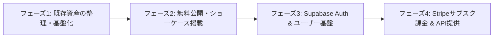

# 将来構想: データ提供事業 & 自作アプリSaaS化 ロードマップ

## 1. 構想の全体像
本リポジトリ（`ayato-studio`）を基盤として、以下の2軸でサブスクリプション型サービス（B2B / B2C）を展開します。

1. **データ提供プラットフォーム (`edinetdb.jp` モデル)**:
   - EDINET/適時開示/財務/AI動向データのAPI提供およびWeb検索ポータル。
2. **自作ツールのSaaS・クラウド共有プラットフォーム (`Trancform_MovieToText` 等)**:
   - デスクトップアプリのクラウド同期、Web完結の文字起こし・AI分析、チーム/社内共有機能。

---

## 2. サービスモデル設計

### A. データ提供事業 (Financial & Tech Intelligence API)
- **公開先**: `finance.ayato-studio.ai` または `api.ayato-studio.ai`
- **データソース**: `ayato_reporter`（EDINET API, TDnet, arXiv, 各種テックフィード）
- **プラン設計**:
  | プラン | 価格帯 | 機能・制限 |
  | :--- | :--- | :--- |
  | **Free** | 0円 | Web上での直近データ検索（過去3ヶ月）、API月100回、簡易要約 |
  | **Pro (個人/開発者)** | 月額 1,980円〜 | 過去全期間データ検索、API月10,000回、詳細財務指標、CSV/JSONエクスポート |
  | **Business (企業)** | 月額 9,800円〜 | 高頻度API（月10万回〜）、Webhook通知、カスタム分析レポート |

### B. 自作アプリSaaS化 (`Trancform_MovieToText` 連携)
- **公開先**: `ayato-studio.ai/apps/transcribe` または `transcribe.ayato-studio.ai`
- **主要機能**:
  - Webブラウザからの動画/音声アップロード → 自動文字起こし（Whisper / Gemini Flash）→ AI要約・議事録作成
  - 既存デスクトップアプリ版とのアカウント連携・データ同期
  - 社内共有・ワークスペース機能（リンク1つで議事録・文字起こし結果を社内共有）
- **プラン設計**:
  | プラン | 価格帯 | 機能・制限 |
  | :--- | :--- | :--- |
  | **Free** | 0円 | 月30分までの文字起こし、ローカル実行機能 |
  | **Pro** | 月額 1,480円 | 月10時間クラウド文字起こし、AI議事録・話者分離、クラウド保存無制限 |
  | **Team** | 月額 4,980円/5名〜 | チーム共有ワークスペース、共有フォルダ、アクセス権限管理 |

---

## 3. 実現に向けた段階的ロードマップ

1. **フェーズ1: 既存資産の整理・基盤化（現在のステップ）**
   - 不要ファイルのクリーンアップ、共通DB/認証設計の確立。
2. **フェーズ2: 無料公開・ショーケース掲載**
   - `ayato-studio.ai` 上に `MovieToText` などの自作アプリの紹介・ダウンロード・Webデモページを設置。
   - `finance.ayato-studio.ai` にて収集済みの開示・要約データを無料公開して集客開始。
3. **フェーズ3: Supabase Auth 連携 & チーム共有基盤**
   - ユーザー登録・ログイン、共有URL生成機能の実装。
4. **フェーズ4: Stripeサブスク課金 & 有料API提供**
   - Stripe Checkout / Customer Portal を接続し、有料プランの提供を開始。
