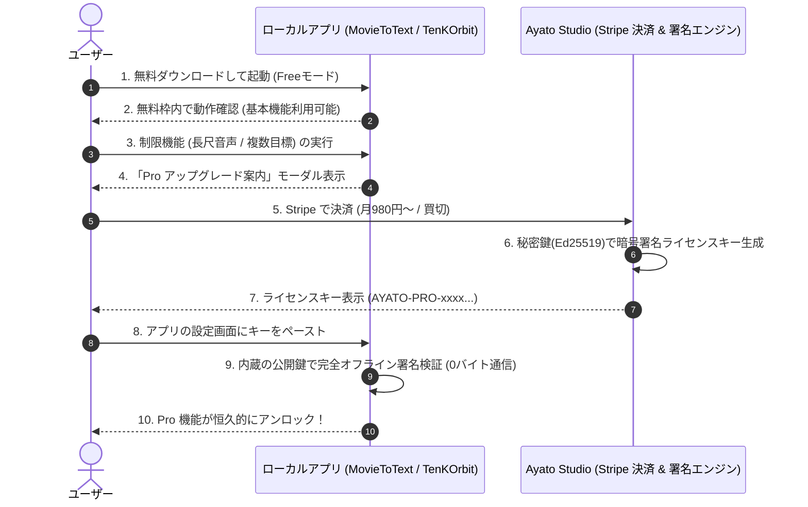

# Ayato Studio: フリーミアム境界設計 ＆ 完全オフライン暗号ライセンス仕様書

## 1. 全体アーキテクチャ概要



---

## 2. 有料と無料の明確な境目（Feature Gating Matrix）

### ① `Transform_MovieToText`（AI文字起こし＆議事録）

| 機能 | Community Free（無料枠） | Pro Plan（月額1,480円 / 買切9,800円） |
| :--- | :--- | :--- |
| **音声・動画の長さ制限** | **1ファイルあたり最大 10 分まで** | **無制限（1時間〜3時間の長尺会議もOK）** |
| **話者分離 (CAM++)** | 利用可能（10分以内） | **無制限利用可能** |
| **会議要約・議事録生成** | 基本要約テンプレート | **多機能テンプレート ＆ カスタムプロンプト** |
| **Non-Embedding RAG** | 直近 3 会議のみ検索 | **過去全会議の横断検索（無制限）** |
| **一括バッチ処理** | 1ファイルずつ処理 | **フォルダごと複数ファイル一括処理** |

### ② `TenKOrbit`（1万時間学習管理 × ローカルAI伴走）

| 機能 | Community Free（無料枠） | Pro Plan（月額980円 / 買切4,980円） |
| :--- | :--- | :--- |
| **大項目（夢: 1万時間）** | 1 個 | **無制限** |
| **アクティブ中項目（資格目標）** | **最大 1 個まで**（例: 司法試験のみ） | **最大 5 個まで同時進行可能** |
| **手書きノート OCR ＆ AI評価** | **週 3 回まで** | **毎日無制限利用 ＆ 弱点分析レポート** |
| **戦術トラッキング集計** | 今週・先週のみ | **全期間（過去月・カスタム期間）無制限集計** |
| **Android APK 版の利用** | 手動ビルドのみ | **バイナリ配布 ＆ 優先アップデート** |

---

## 3. ライセンスキーのデータ構造と暗号署名仕様

### A. ペイロード（署名前データ: JSON）
```json
{
  "product": "movie-to-text",
  "email": "user@example.com",
  "plan": "pro_monthly",
  "created_at": "2026-08-29T14:00:00Z",
  "expires_at": "2026-09-29T14:00:00Z"
}
```
*(※ 買切プランの場合は `expires_at: "never"` または `null`)*

### B. 暗号化方式
- **アルゴリズム**: **Ed25519**（高速・堅牢・署名長がわずか 64 バイト）
- **キー形式**:
  `AYATO-` + `[Base64 URL-Safe Encoded Payload]` + `.` + `[Base64 URL-Safe Signature]`
- **検証処理（クライアント側: Python）**:
  ```python
  from cryptography.hazmat.primitives.asymmetric import ed25519
  import base64
  import json

  PUBLIC_KEY_HEX = "0123456789abcdef..." # アプリにハードコードされた公開鍵

  def verify_license(license_key_str: str) -> dict | None:
      try:
          prefix, payload_b64, sig_b64 = license_key_str.split(".")
          payload_bytes = base64.urlsafe_b64decode(payload_b64)
          sig_bytes = base64.urlsafe_b64decode(sig_b64)
          
          public_key = ed25519.Ed25519PublicKey.from_public_bytes(bytes.fromhex(PUBLIC_KEY_HEX))
          public_key.verify(sig_bytes, payload_bytes)
          
          data = json.loads(payload_bytes)
          # 有効期限チェック（ローカル時計またはオフライン検証）
          return data
      except Exception:
          return None # 改ざんまたは不正キー
  ```
