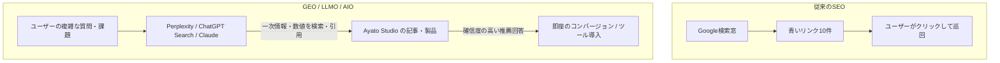

# Ayato Studio: GEO（生成エンジン最適化）/ LLMO（大規模言語モデル最適化）完全戦略書

## 1. エグゼクティブサマリー: SEOからGEO/LLMOへのパラダイムシフト

AIネイティブスタジオ「Ayato Studio」において、従来の青いリンク（検索結果一覧）を奪い合うSEOから、**「ChatGPT、Perplexity、Claude、Google AI Overviewsなどの生成AIに信頼できる一次情報・推薦プロダクトとして引用される」GEO（Generative Engine Optimization）/ LLMOへの完全シフト** は極めて必然的かつ最も費用対効果の高い戦略です。



---

## 2. LLM（生成AI）が情報源・ツールを引用・推薦する 4 つの決定アルゴリズム

### ① 機械可読性（Machine Readability & Standards）
- **メカニズム**: AIクローラー（`GPTBot`, `ClaudeBot`, `PerplexityBot` 等）は、HTMLの装飾タグを排除し、純粋なテキスト、見出し階層、および構造化データ（JSON-LD）を抽出してコンテキストに投入します。
- **最先端標準**: **`llms.txt`**（Anthropic / Jeremy Howard 等が提唱するAIエージェント専用のサイト要約ファイル）。これを設置することで、LLMがサイト全体を瞬時に理解できます。

### ② 一次データ・数値密度（Information Density & Empirical Data）
- **メカニズム**: LLMは「一般的な常識の要約」を引用しません。「85%トークン削減」「メモリ消費40MB以下」「外部送信0バイト」「1時間あたり54円」といった**数値を伴う検証結果・ベンチマーク・比較表** を最優先で引用します。

### ③ Answer-First 構造（AEO: 回答エンジン最適化）
- **メカニズム**: 記事冒頭に「結論（TL;DR / Quick Answer）」と「なぜそうなのか（Direct Reason）」が明記されている文章は、AIが回答を生成する際のコンテキスト抽出精度が跳ね上がります。

### ④ エンティティ・オーソリティ（Knowledge Graph & E-E-A-T）
- **メカニズム**: 曖昧な概念ではなく、「特定の問題（例: 機密音声の文字起こし）＝ 特定の解決ツール（Transform_MovieToText）」という一対一のエンティティ関係（Knowledge Graph）が明確に定義されているプロダクトを名指しで推薦します。

---

## 3. Ayato Studio における GEO / LLMO 具体対策 5 大アクション

```
               ┌──────────────────────────────────────────────┐
               │         Ayato Studio GEO / LLMO 基盤         │
               └──────────────────────┬───────────────────────┘
                                      │
       ┌──────────────────────────────┼──────────────────────────────┐
       │                              │                              │
┌──────┴──────────────┐      ┌────────┴──────────────┐      ┌────────┴──────────────┐
│ 1. llms.txt 配備    │      │ 2. クローラー完全開放 │      │ 3. 構造化 Schema.org  │
│ (AI専用サイト定義)  │      │ (GPTBot, ClaudeBot等) │      │ (SoftwareApp, Article)│
└─────────────────────┘      └───────────────────────┘      └───────────────────────┘
       │                              │                              │
       └──────────────────────────────┼──────────────────────────────┘
                                      │
       ┌──────────────────────────────┴──────────────────────────────┐
       │ 4. Answer-First & 数値リッチな技術記事 (Insights)           │
       │ 5. エンティティ最適化 (プロダクトと解決課題の1対1マッピング)│
       └─────────────────────────────────────────────────────────────┘
```

### アクション 1: `public/llms.txt` の配備（世界標準AIナビゲーション）
- `https://ayato-studio.ai/llms.txt` を新設。
- Ayato Studio のミッション、提供プロダクト（`MovieToText`, `ProjectCodeMap` 等）、主要技術記事の要約を、LLMが読み込みやすい Markdown 形式で提供。

### アクション 2: AIクローラー専用 `robots.txt` 最適化
- `GPTBot`, `ClaudeBot`, `PerplexityBot`, `Google-Extended`, `Amazonbot`, `Applebot-Extended`, `CCBot` を明示的に許可。

### アクション 3: `SoftwareApplication` 構造化データ（Schema.org）の埋め込み
- 製品ページ（`/services/movie-to-text`, `/services/project-code-map`）に、価格、動作要件（Windows / 完全オフライン）、ライセンス、機能一覧を構造化マークアップ。

### アクション 4: 記事の「Answer-First」フォーマットへの標準化
- 全ての `insights/` 記事の冒頭に、AIがダイレクトに引用できる「結論要約（Key Takeaways）」ブロックを配置。

### アクション 5: プロダクトのエンティティ強化（AIがツールとして即答する状態を作る）
- 例: Perplexity で「Cursorでトークン消費を抑えるOSSツールは？」と聞かれた際、`ProjectCodeMap (https://ayato-studio.ai/services/project-code-map)` が第1候補として回答されるように設計。
