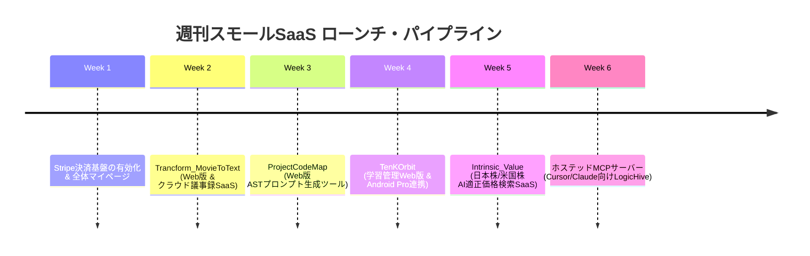

# Ayato Studio: 既存作品の探索結果 & 「週刊スモールSaaS」ローンチ計画書

## 1. エグゼクティブサマリー
`C:\Users\saiha\My_Service\programing` 配下を精査した結果、**すでに商用レベルの完成度を持つ 6 つのキラープロダクト** が眠っていることが確認されました。
「固定費ほぼゼロ」の基盤を活かし、これらを **「週に1プロダクトずつ Web / SaaS / 有料版として Ayato Studio 配下に連続リリース（乱射）する」** 実行計画を策定しました。

---

## 2. 既存作品の探索・棚卸し結果一覧

| プロダクト名 | 概要・強み | 提供形態 | マネタイズモデル（想定） |
| :--- | :--- | :--- | :--- |
| **1. `Trancform_MovieToText`** | 高精度動画・音声文字起こし & AI議事録生成 | Webアプリ / デスクトップ | 無料（15分/月） / **Pro月額 1,480円** |
| **2. `TenKOrbit`** | 1万時間の法則 × ローカルAI伴走指導・学習管理 | Web版 / Android APK | 無料 / **Pro月額 980円 (買切4,980円)** |
| **3. `Intrinsic_Value`** | バフェット流 財務×モートAI適正株価算出エンジン | Webポータル / API | 無料(主要銘柄) / **Pro月額 2,980円** |
| **4. `ProjectCodeMap`** | AIコーディング用 ASTコンテキスト圧縮・マップ生成 | Webツール / CLI | 無料(CLI) / **Web Pro月額 980円** |
| **5. Chrome拡張シリーズ** | `Gmail誤送信防止` ＆ `Site Downloader` | Chrome拡張 | 無料 / **ライセンス買切 1,980円** |
| **6. `LogicHive` & `Ripen`** | AIエージェント用 高品質コード資産 & 長期記憶MCP | ホステッドMCP / API | **開発者サブスク 月額 1,480円** |

---

## 3. 「週刊スモールSaaS」6週間連続ローンチ・ロードマップ

### 第1週: 基盤整備「Stripe サブスクリプション & 決済ハブの有効化」
- **目標**: すべての自作プロダクトに共通して使える「Stripe 月額サブスク & 単発決済」の仕組みを本番稼働させる。
- **実装内容**:
  - `src/app/actions/stripe-checkout.ts` を拡張し、`mode: 'subscription'` と `mode: 'payment'` を両対応に。
  - Supabase の `user_subscriptions` テーブルと Stripe Webhook を接続し、課金状態を自動同期。

### 第2週: 第1弾「MovieToText Web (AI文字起こし & 議事録SaaS)」
- **目標**: `ayato-studio.ai/apps/transcribe` でWeb完結の音声/動画アップロード → Whisper/Gemini文字起こしを提供。
- **プラン**:
  - Free: 月15分まで無料文字起こし。
  - Pro (月額 1,480円): 月10時間、話者分離、AI要約・議事録生成、共有リンク発行。

### 第3週: 第2弾「ProjectCodeMap Web (AI開発コンテキスト圧縮SaaS)」
- **目標**: GitHubリポジトリURLまたはZIPを入れるだけで、ChatGPT/Claude/Cursorに最適化された最小トークンXML/Markdownを出力。
- **プラン**:
  - Free: 月3回までリポジトリ解析。
  - Pro (月額 980円): 無制限解析、プライベートリポジトリ連携、AST依存関係グラフ図の出力。

### 第4週: 第3弾「TenKOrbit Cloud (1万時間AI伴走コーチ)」
- **目標**: 難関資格受験生やスキル習得者向けに、学習時間の自動集計とAI伴走フィードバックをWeb/スマホで提供。
- **プラン**:
  - Free: 学習時間タイマー・日次入力。
  - Pro (月額 980円 / 買切 4,980円): 手書きノートOCR指導、弱点分析レポート、Androidクラウド同期。

### 第5週: 第4弾「Intrinsic Value Radar (割安株・適正株価AI検索)」
- **目標**: `finance.ayato-studio.ai` にて、1万社から選別されたバフェット流バリュエーションスコアを公開。
- **プラン**:
  - Free: 日経225等の代表銘柄スコア閲覧。
  - Pro (月額 2,980円): 全銘柄適正価格検索、割安度ランキング、決算後の割安アラート通知。

### 第6週: 第5弾「Ayato Hosted MCP Hub (AI開発者向けナレッジAPI)」
- **目標**: Cursor や Claude Desktop に URL を貼り付けるだけで、`LogicHive`（再利用コード資産）や `Ripen`（長期記憶）を使えるクラウドMCPエンドポイント。
- **プラン**:
  - Pro (月額 1,480円): APIキー発行、高速レスポンス、独自ナレッジの追加。

---

## 4. ステップ 1: Stripe決済の有効化 具体的手順

1. **Stripe ダッシュボードで本番/テスト APIキーを取得**:
   - `STRIPE_SECRET_KEY` (`sk_test_...` または `sk_live_...`)
   - `NEXT_PUBLIC_STRIPE_PUBLISHABLE_KEY` (`pk_test_...` または `pk_live_...`)
2. **Stripe Product / Price の作成**:
   - `MovieToText Pro` (月額 1,480円)
   - `Ayato Studio Supporter / Pro Plan`
3. **サーバーアクション (`stripe-checkout.ts`) のサブスク対応**:
   - `price_id` を受け取って Stripe Checkout Session を作成するロジックの整備。
4. **Webhook エンドポイント (`src/app/api/webhooks/stripe/route.ts`) の追加**:
   - `checkout.session.completed`, `customer.subscription.deleted` を受信して Supabase のプランを更新。
