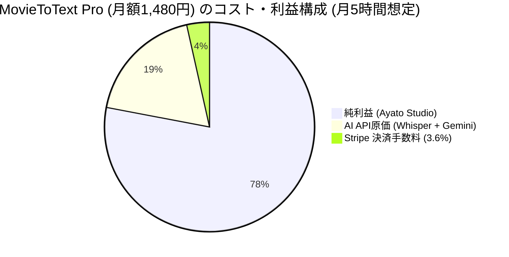

# Ayato Studio: 原価計算（Unit Economics）& マーケティング戦略分析書

## 1. 原価構造（Unit Economics）の精緻な試算

### A. 提供モデル別の原価・粗利益率比較

| 提供形態 | 想定月額 / 買切価格 | ユーザー1人あたりの月間原価 | 粗利益 | 粗利益率 |
| :--- | :--- | :--- | :--- | :--- |
| **1. 完全ローカル配布モデル (EXE/オープンコア)** | **買切 4,980円** (または月額980円) | **0 円** (ユーザーPCのCPU/GPUで動作) | **4,800 円** (手数料引後) | **96.4%** |
| **2. クラウドSaaSモデル (Web版 Whisper/Gemini)** | **月額 1,480 円** | **約 275 円** (月5時間の利用想定) | **1,205 円** | **81.4%** |
| **3. 法人/プロ向け機密保持モデル** | **月額 4,980 円** | **0 円 〜 550 円** | **4,430 円 〜 4,800 円** | **89.0% 〜 96.4%** |



### B. クラウドAPI従量原価の内訳（1時間あたりのコスト）
- **音声認識 (OpenAI Whisper API)**: $0.006 / 分 ＝ **約 54 円 / 時間**
- **AI要約・構造化 (Gemini 2.0 Flash)**: 入力約1.5万トークン ＝ **約 0.5 円 / 時間**
- **合計API原価**: **1時間の会議あたり 約 55 円**
- **損益分岐点**: ユーザーが月26時間以上クラウドAPIを使い倒さない限り、月額1,480円で確実に黒字（一般的な月間会議時間は5〜10時間程度）。

---

## 2. 競合比較とポジショニングマップ

```
                【完全機密保持・ローカル完結】
                             │
                             │  ★ Ayato MovieToText
                             │    (100%ローカル / 話者分離 / Non-Embedding RAG)
                             │
【低価格・定額】 ─────────────┼───────────── 【高価格・従量課金】
                             │
              CLOVA Note     │    Notta / Otter.ai
                             │    (クラウド送信必須 / 月2,000円〜)
                             │
                 【クラウド送信・外部依存】
```

### 差別化の核心（Unique Selling Proposition）:
1. **セットアップ完了後は「完全オフライン（ネット回線切断）」で動作保証**:
   - モデルの初回ダウンロード完了後は、**Wi-FiやLANケーブルを物理的に抜いた「エアギャップ（Air-gapped）環境」でも100%全機能（文字起こし＋話者分離＋AI要約＋ナレッジ検索）が動作**。
   - テレメトリ（利用状況追跡）やバックグラウンド通信も一切存在しない。
2. **通信環境ゼロ（飛行機内・新幹線・電波圏外）での即時生産性**:
   - 移動中や電波の届かない場所でも、録音ファイルを放り込むだけでその場で議事録が完成。
3. **Non-Embedding RAG による究極の軽量性**:
   - 重いEmbeddingモデルを排除し、普通のノートPC（Zoom/Teams起動中）でもサクサク動く。
4. **話者分離 (CAM++) の高精度なローカル判定**:
   - 誰が発言したかをオフラインで完全特定。

---

## 3. ターゲット顧客（ペルソナ）と獲得戦略

### ターゲット 1: 機密保持必須のプロフェッショナル（B2B / 士業）
- **ペルソナ**: 弁護士、公認会計士、税理士、M&Aアドバイザー、上場企業IR/役員秘書。
- **ペイン**: クラウド文字起こしは情報漏洩・規約違反になるが、手動での議事録作成は膨大な工数がかかる。
- **メッセージ**: **「ネット回線を抜いても動く。1バイトも外部送信しない完全機密保持AI議事録」**
- **推奨プライシング**: **ライセンス買切 9,800円 / 法人月額 4,980円**

### ターゲット 2: 取材・インタビューの多いクリエイター・研究者
- **ペルソナ**: ライター、記者、大学教授・大学院生、ポッドキャスター。
- **ペイン**: 毎月の録音時間が長すぎて、クラウドSaaSの従量課金だと毎月1〜2万円飛んでいく。
- **メッセージ**: **「定額・無制限。自分のPCスペックをフル活用して何十時間でもコスト0円で文字起こし」**
- **推奨プライシング**: **Proライセンス 4,980円（買切） / 月額 980円**

---

## 4. マーケティング・集客チャネル設計

```mermaid
graph TD
    SEO[1. SEO比較・解説記事<br/>『Notta禁止企業の代替ツール』] --> LP[Ayato Studio アプリ紹介LP]
    X[2. X/Twitter デモ動画<br/>『ネット遮断でも動くAI議事録』] --> LP
    Zenn[3. 技術記事 (Zenn/Qiita)<br/>『Non-Embedding RAG設計思想』] --> LP

    LP --> Free[無料版ダウンロード / お試し体験]
    Free --> Pro[Pro版購入 / Stripeサブスク]
```

1. **技術ブランディング (Zenn / Qiita / Note)**:
   - 「なぜ我々はEmbeddingを捨ててSQLite FTS5+LLMでRAGを作ったのか？（省メモリ設計の極意）」
   - 「100%ローカルで動くWindows専用AI文字起こしツールの設計思想」
   - *効果*: エンジニアや技術感度の高い意思決定者からの被リンク・信頼獲得。
2. **キラー比較記事 (自サイト `/insights` & SEO)**:
   - 「【2026年最新】社内機密情報を守るローカル文字起こしツール比較（Notta・CLOVA Noteとの違い）」
   - *効果*: 「Notta 機密情報」「議事録 AI ローカル」等の購買意欲が最も高い検索キーワードを獲得。
3. **SNSでのバイラルデモ動画**:
   - ネット接続を物理的に遮断した状態（機内モード）で、話者分離と議事録生成がリアルタイムに動作する30秒画面録画をX（Twitter）で公開。
