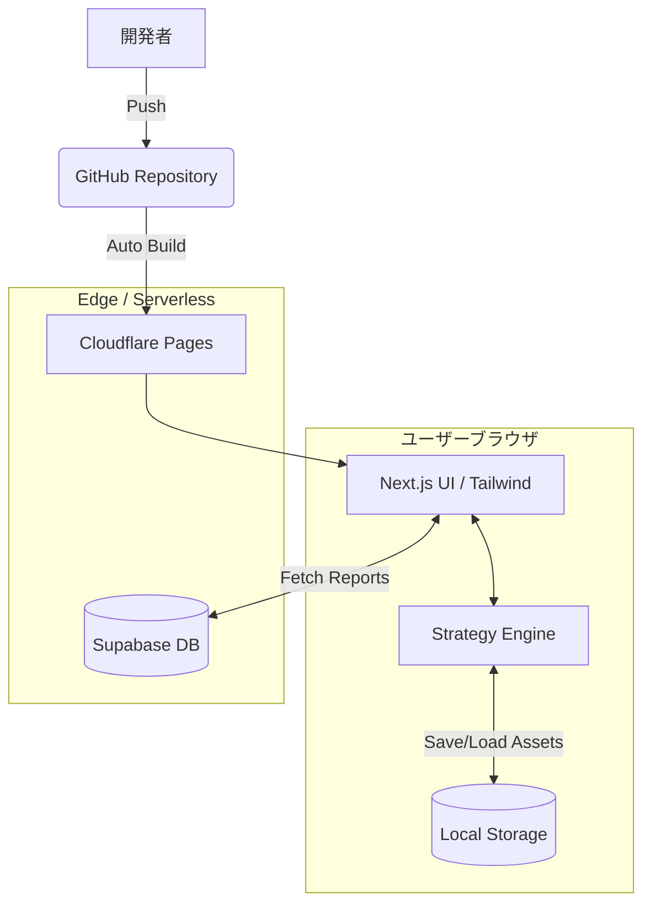

# Ayato Studio Portal アーキテクチャ構成

本ドキュメントでは、Ayato Studio Portal のシステム構成、データフロー、およびデプロイメント・アーキテクチャについて詳述します。

## 1. システム・オーバービュー

Ayato Studio Portal は、サーバーサイド配信 (Ayato Reporter) とクライアントサイド知能 (Portfolio Strategist) のハイブリッド構成を採用しています。

## 2. 主要コンポーネント

### 2.1 閲覧レイヤー (Reporter Feed)
- **Supabase**: レポートデータの保存。Row Level Security (RLS) により、クライアントからは Read-Only でアクセス。
- **next-on-pages**: Cloudflare Pages 上でエッジ実行され、高速なレポート配信を実現。

### 2.2 戦略レイヤー (Portfolio Strategist)
- **Strategy Engine**: 追加投資のみでリバランスを行う「No-Sell」アルゴリズム。
- **Local Persistence**: 資産データは一切サーバーへ送信せず、ブラウザの `LocalStorage` にのみ保存（プライバシー・バイ・デザイン）。

## 3. CI/CD ワークフロー

Ayato Studio Portal は、GitHub と Cloudflare Pages を基盤とした **GitOps** を採用しています。

- **GitHub Actions**: 
    - `lint.yml`: Ruff, ESLint, Prettier による品質チェック。
    - `release.yml`: semantic-release による自動バージョン管理。
- **Deployment**:
    - `main` ブランチへの Push をトリガーに Cloudflare Pages が自動ビルド・デプロイ。

## 4. セキュリティとプライバシー

1. **データ分離**: 
   公開情報（レポート）はクラウド上の Supabase、個人情報（資産データ）はローカルのブラウザという完全な分離を実現。
2. **通信の最小化**: 
   資産運用機能はオフラインに近い状態で動作し、外部 API への依存を最小限に抑えることで堅牢性を確保。