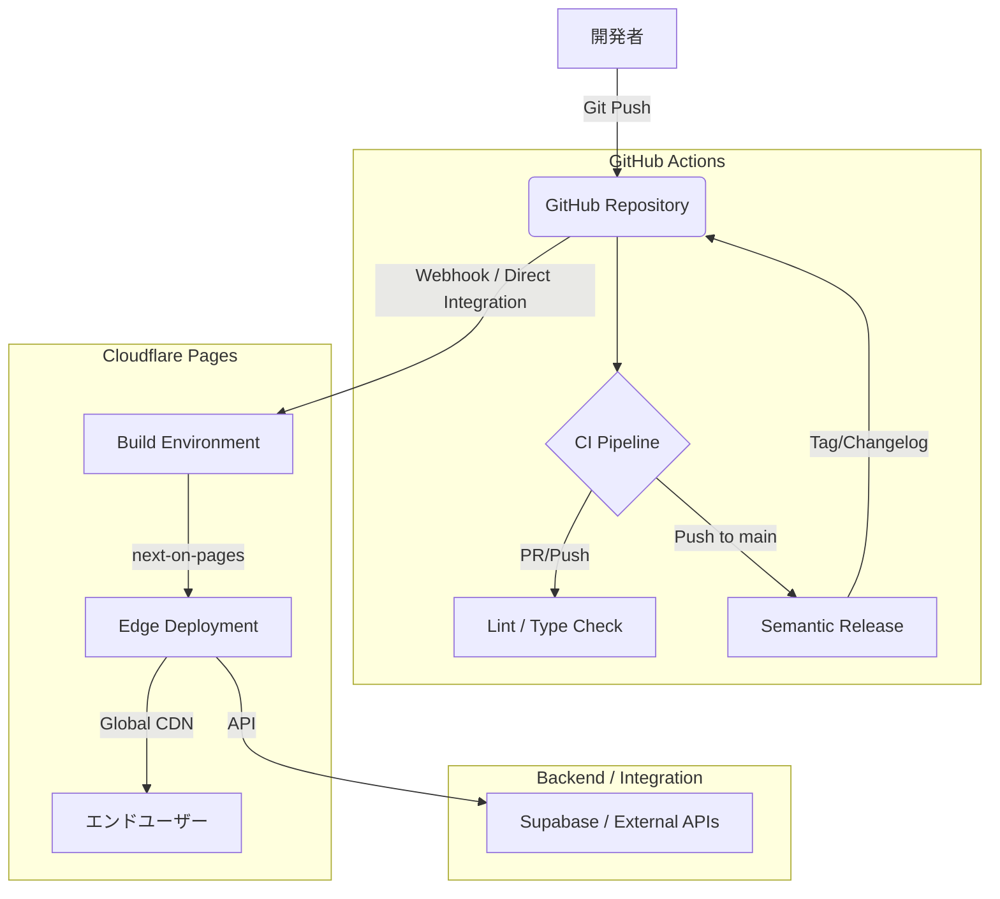

# Ayato Studio Portal アーキテクチャ構成

本ドキュメントでは、Ayato Studio Portal の CI/CD およびデプロイメント・アーキテクチャについて詳述します。

## 概要

Ayato Studio Portal は、GitHub と Cloudflare Pages を基盤とした現代的な **GitOps ワークフロー**を採用しています。開発者が GitHub にコードを Push するだけで、自動的に品質チェック、バージョン管理、およびグローバルエッジネットワークへのデプロイが完了する構成となっています。

## システム・アーキテクチャ

## 主要コンポーネント

### 1. バージョン管理とソースコード
- **GitHub**: ソースコードのホスティング。`main` ブランチが本番環境の Single Source of Truth (SSoT) として機能します。

### 2. CI (Continuous Integration)
- **GitHub Actions**:
    - **lint.yml**: コードスタイルと静的解析を実行し、品質を担保します。
    - **release.yml**: `semantic-release` を使用し、コミットメッセージに基づいて自動的にバージョン採番と CHANGELOG の生成、GitHub Release の作成を行います。

### 3. CD (Continuous Deployment)
- **Cloudflare Pages (Direct Git Integration)**:
    - GitHub の特定ブランチ（`main`）への更新を検知し、自動的にビルドを開始します。
    - **Build Command**: `npx @cloudflare/next-on-pages` (Next.js をエッジ実行用に変換)
    - **Deployment**: ビルド結果は Cloudflare のグローバルネットワークに即座に配布され、世界中から低遅延でアクセス可能になります。